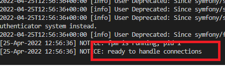

# spin up the back-end

**_NOTE:_**
With the front-end running in `port:8000`, change directory out of the folder to the root of your repo. With Docker Desktop running:

---

```cli
docker-compose pull
docker-compose up
```

## To run the development build

```cli
docker-compose -f docker-compose-dev.yml pull
docker-compose -f docker-compose-dev.yml up
```

---

**_NOTE_**
Allow Docker the time to pull all the images required and spin up the back-end. After a few minutes, a `ready to handle connections` message will be displayed in the terminal. You are now able to log in from the frontend of the application.



We integrated another open source project called [Common Gateway](https://github.com/ConductionNL/commonground-gateway) to authenticate and connect to APIs. This gateway allows us to define how to authenticate to external APIs and help with user authentication.

The log in for this is:

```cli
Username : test@gateway.local
Password: !ChangeMe!
```

<!-- klopt dit?? -->
<!-- To use the gateway Docker desktop is required on your machine. Navigate to [http://localhost:83/](http://localhost:83/) to view the app in your browser. -->
