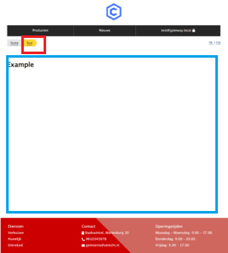

# Development of the Skeleton Application

The following examples assumes understanding of `HTML` `CSS` and `JavaScript`. Basic understanding of how [React](https://reactjs.org/docs/getting-started.html), [Gatsby](https://www.gatsbyjs.com/) and [TypeScript](https://www.typescriptlang.org/) work is highly recommended for developing and customizing the skeleton application.

This page consists of the following parts:

- Adding Design Tokens from the NL Design Library
- Adding a component from the NL Design Library
- Adding a component directly in the application
- Adding pages

## Adding Design Tokens and importing component from a NL Design Library

In the NL Design System there are multiple participants and for this example we will use both [Den Haag's](https://nl-design-system.github.io/denhaag/?path=/story/den-haag-introduction--page) and [Utrecht's](https://github.com/nl-design-system/utrecht) library.

## _Importing a component from a library_

Below is a `<Button/>` implemented in the top-level `<App />` component. There are two steps to do this

---

**_NOTE_**

The package should be installed by default. In case you an import error, install it manually:

`$ npm install @gemeente-denhaag/components-react`

---

```JavaScript
import { Button, StylesProvider } from "@gemeente-denhaag/components-react"; // This is step 1
// Import your design tokens here as well! Otherwise your components will be unstyled (below is documented how to do this)

function App() {
  return (
    <StylesProvider>
      <Button variant="primary-action">Click here!</Button>
    </StylesProvider>
  );
} // The <Button> component is implemented here

export default App;
```

## _Adding design tokens_

Introducing `NL Design Tokens`. Whereas using classnames to store `CSS` rules is a classic method, exporting a bundle classnames as tokens to be used in other applications is a clever way to endorse a modular ecosystem. Design tokens are all the values needed to construct and maintain a design system — spacing, color, typography, object styles, animation, etc. — represented as data. Replacing one design token for another will quickly change the look of an application, without the need to write custom css.

Mixing components from one library and the design tokens from another library is where things get interesting. To do this, import the tokens in the file of the component to add the design tokens itself. Now you can import the tokens and add them (for instance) to the `<Button />` component by adding `--utrecht-color-blue-35`. This changes the button color to a light blue.

---

**_NOTE_**

The package should be installed by default. In case you an import error, install it manually:

`$ npm i @utrecht/design-tokens`

---

The code would look like:

```JavaScript
import { Button, StylesProvider } from "@gemeente-denhaag/components-react";
import * from @utrecht/design-tokens; // here the tokens are add from the Utrecht library

function App() {
  return (
    <StylesProvider>
      <Button className="--utrecht-color-blue-35" variant={"primary-action"}>Click here!</Button>
    </StylesProvider>
  );
}

export default App;
```

## _Adding a component directly_

Below is an example of how a `TopNav` component is added in TypeScript.

You can name the files any other way you like. To add a `TopNav` component in the terminal:

```cli
cd /src/components
mkdir topNav
touch TopNav.tsx
touch TopNav.css
```

or use the IDE interface per your preference.

Add the following code in `TopNav.tsx`

```TypeScript
import * as React from "react"; // Import everything you need from React
import { Link } from "gatsby"; // Gatsby's way of local linking.

// interfaces are required values for the component.
interface ITopNavItem {
  href: string; // hyperlink
  title: string | JSX.Element; // displayed name of link
  current?: boolean; // optional
}

interface TopNavProps {
  items: ITopNavItem[];
}

export const Menu: React.FC<TopNavProps> = ({ items }) => {
  return (
    <div className="utrecht-navhtml">
      <nav className="topnav">
        <ul className="utrecht-topnav__list">
          {items.map((item, idx) => (
            <li key={idx} className="utrecht-topnav__item">
              <Link
                className={clsx(
                  "utrecht-topnav__link",
                  item.current && "utrecht-topnav__link--focus utrecht-topnav__link--current",
                )}
                to={item.href}
              >
                {item.title}
              </Link>
            </li>
          ))}
        </ul>
      </nav>
    </div>
  );
};

```

This component now is ready to be imported by another component in the application.

That's it. The imported component is written in JSX.

## _Adding pages_

Adding a static page is done by giving the file the same name as the route `route`, here `test.tsx` is used. The filename is automatically implemented in the `breadcrumb`(red box) as well. The content of the page is the blue box.



The code looks like this:

```TypeScript
const ExamplePage = (props: any) => {
  return (
    <>
      <h1>Example</h1>
    </>
  );
};

export default ExamplePage;
```

---

**_NOTE_**
For adding dynamic pages, add a folder with the `route` name. Inside the folder add an `index.tsx` for the page if no `URL` segments are dynamic and a `[id].tsx` when parts of the URL segment are dynamic.

example:

- `src/pages/products/[id].tsx` will generate a route like `products/product`

---

Adding external content from an API can be found [here](./api.md).
