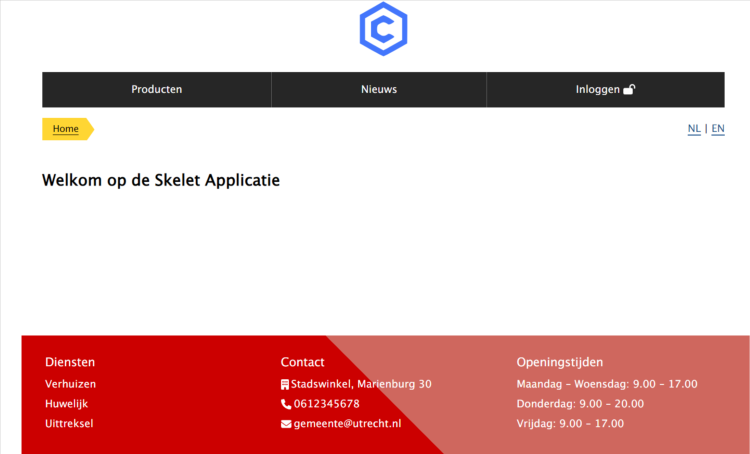

# Front-end

Use the following command to spin up the front-end:

```cli
cd /pwa
npm install
npm run develop
```

Navigate to [http://localhost:8000/](http://localhost:8000/) to view the app in your browser .

The front end should look like this:


